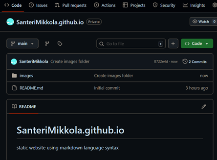
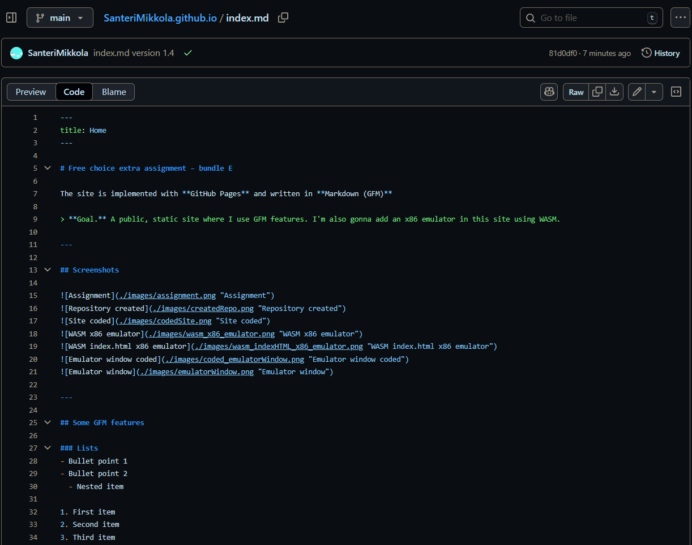
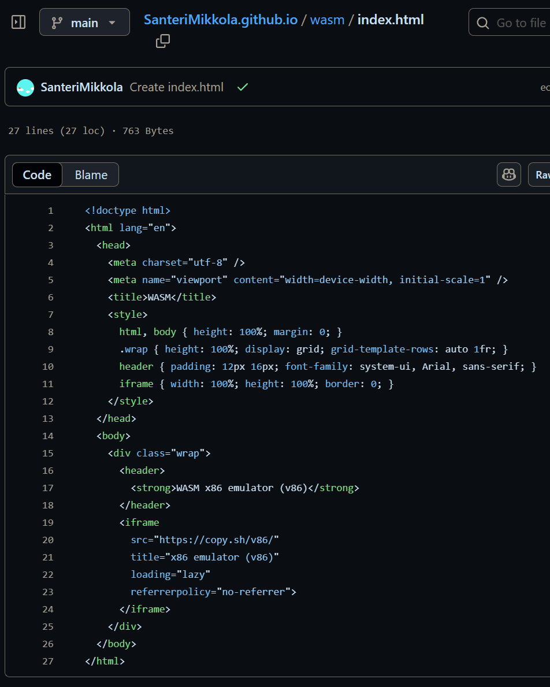
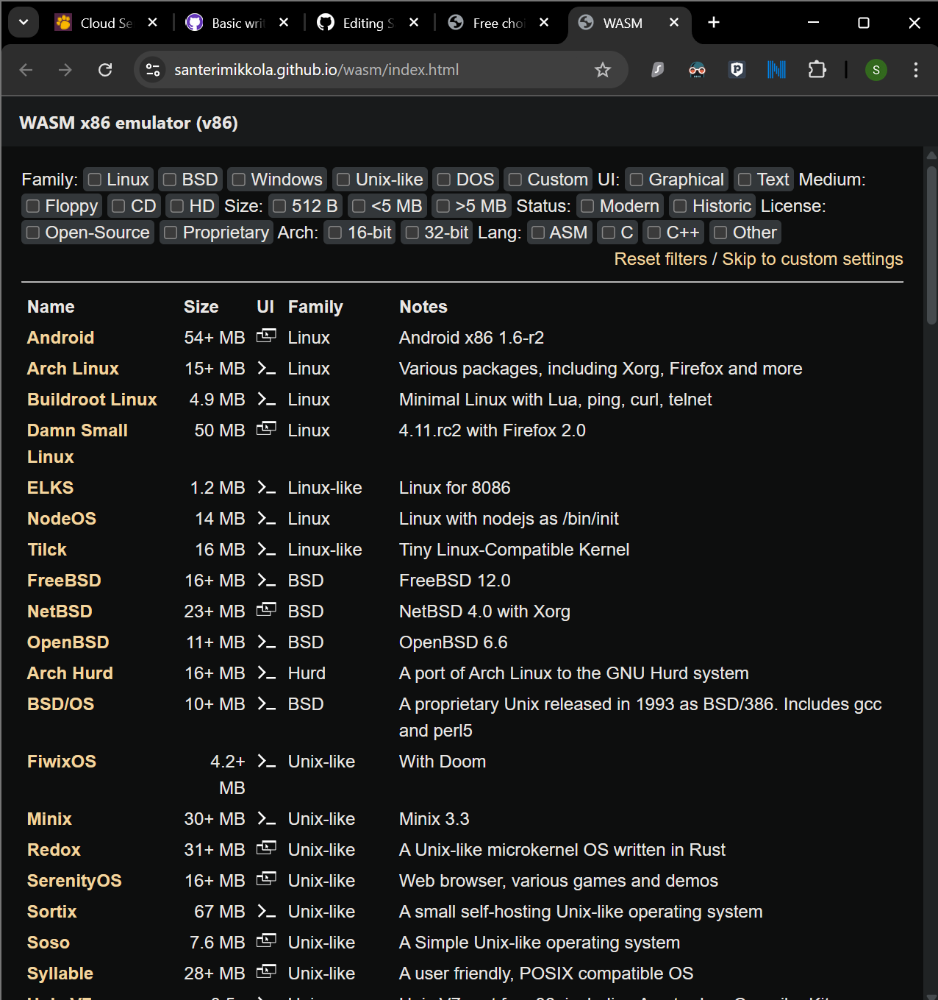
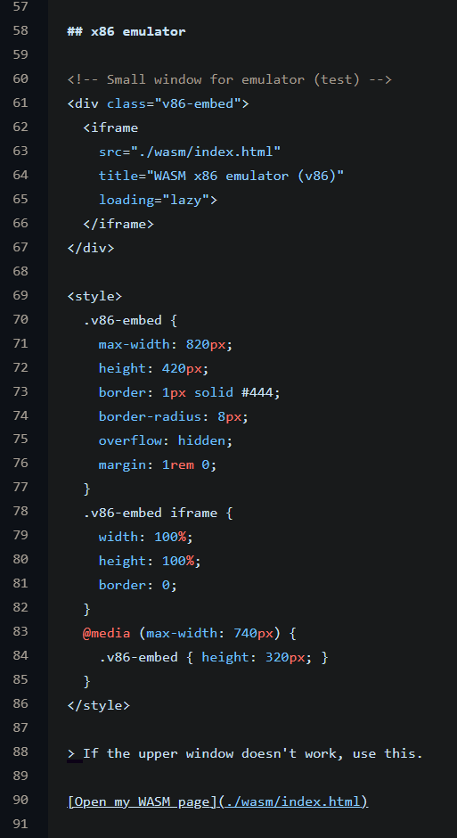
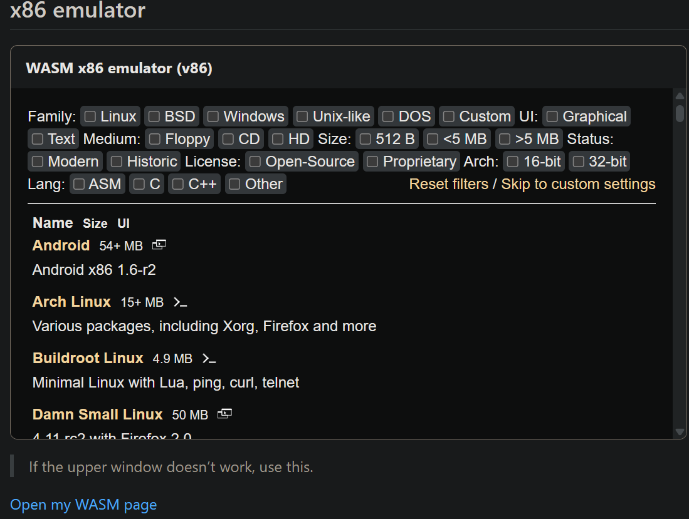

# Free choice extra assignment – bundle E

The site is implemented with **GitHub Pages** and written in **Markdown (GFM)**

> **Goal.** A public, static site where I use GFM features. I'm also gonna add an x86 emulator in this site using WASM.

---

## Screenshots

<details>
  <summary>Click to expand screenshots</summary>

    
    
    
    
    
    
    

</details>

---

## Some GFM features

### Lists
- Bullet point 1
- Bullet point 2
  - Nested item

1. First item
2. Second item
3. Third item

### Table

| Name   | Age | City      |
|--------|----:|-----------|
| Minna  |  41 | Jyväskylä |
| Pasi   |  34 | Pori      |

### Task list
- [x] Created repo
- [x] Coded site
- [x] Added x86 emulator using WASM
- [x] Added screenshots
- [x] Published site  

### Code block
```python
print("Hello, hello, hello! Three times always!")
```

### Emojis
```markdown
🎉 👍 🐧
```

### Quotes
> This is a first level quote.  
>> This is a nested quote.  
>>> Third level quote!

---

## x86 emulator

<!-- Small window for emulator (test) -->
<div class="v86-embed">
  <iframe
    src="./wasm/index.html"
    title="WASM x86 emulator (v86)"
    loading="lazy">
  </iframe>
</div>

<style>
  .v86-embed {
    max-width: 820px;
    height: 420px;
    border: 1px solid #444;
    border-radius: 8px;
    overflow: hidden;
    margin: 1rem 0;
  }
  .v86-embed iframe {
    width: 100%;
    height: 100%;
    border: 0;
  }
  @media (max-width: 740px) {
    .v86-embed { height: 320px; }
  }
</style>

> If the upper window doesn't work, use this.

[Open my WASM page](./wasm/index.html)
