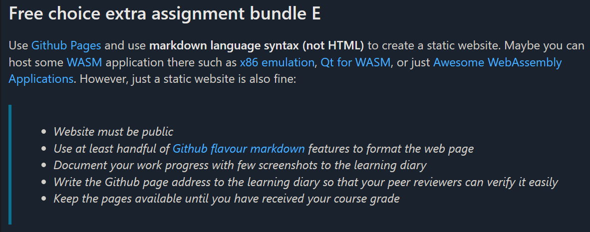

# Free choice extra assignment – bundle E

The site is implemented with **GitHub Pages** and written in **Markdown (GFM)**

> **Goal.** A public, static site where I use GFM features. I'm also gonna add an x86 emulator in this site using WASM.

---

## Screenshots



---

## Some GFM features

### Lists
- Bullet point 1
- Bullet point 2
  - Nested item

1. First item
2. Second item
3. Third item

### Table
| Name   | Age | City     |
|--------|----:|----------|
| Minna  |  41 | Jyväskylä |
| Pasi  |  34 | Pori    |

### Task list
- [x] Created repo
- [x] Coded site
- [ ] Added x86 emulator using WASM
- [ ] Added screenshots
- [ ] Published site  

### Code block
```python
print("Hello Markdown!")
```

### Emojis
```markdown
🎉 👍 🐧
```

### Quotes
> This is a first level quote.  
>> This is a nested quote.  
>>> Third level quote!

---

## x86 emulator

[Open my WASM page](./wasm/index.html)

> If embedding doesn't work, use the link.

**Link:** <https://copy.sh/v86/>
